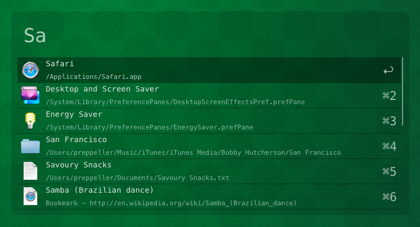

# Code Neue theme for [Alfred](http://www.alfredapp.com/)

## Install

#### [Download](alfred://theme/searchForegroundColor=rgba(255,255,255,0.69)&resultSubtextFontSize=1&searchSelectionForegroundColor=rgba(0,0,0,1.00)&separatorColor=rgba(0,0,0,0.33)&resultSelectedBackgroundColor=rgba(0,0,0,0.33)&shortcutColor=rgba(255,255,255,0.64)&scrollbarColor=rgba(255,255,255,0.43)&imageStyle=4&resultSubtextFont=Menlo&background=rgba(0,0,0,0.13)&shortcutFontSize=3&searchFontSize=3&resultSubtextColor=rgba(243,248,255,0.55)&searchBackgroundColor=rgba(0,0,0,0.00)&name=Code%20neue&resultTextFontSize=1&resultSelectedSubtextColor=rgba(243,248,255,0.73)&shortcutSelectedColor=rgba(255,255,255,0.67)&widthSize=4&border=rgba(231,231,231,0.00)&resultTextFont=Menlo&resultTextColor=rgba(222,222,222,1.00)&cornerRoundness=0&searchFont=Menlo&searchPaddingSize=3&credits=Zander%20Martineau&searchSelectionBackgroundColor=rgba(181,213,255,1.00)&resultSelectedTextColor=rgba(255,255,255,0.87)&resultPaddingSize=4&shortcutFont=Menlo) the theme

## License

MIT
